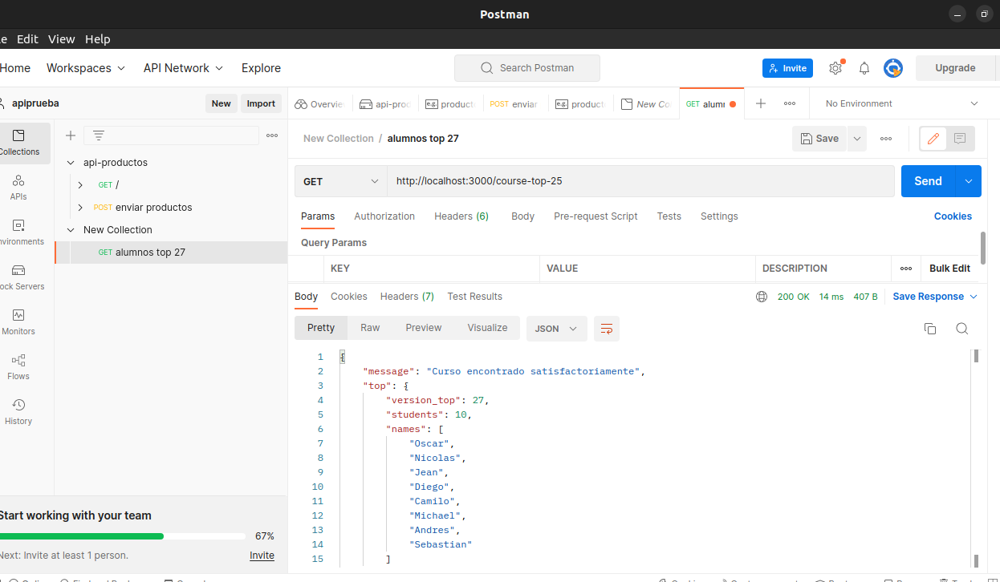

# Make It Real - NAME OF THE PROJECT

This is a solution to the  Express 1 - top27  project of the Make It Real course.
# Table of contents

- [Overview](#overview)
  - [The challenge](#the-challenge)
  - [Screenshot](#screenshot)
- [My process](#my-process)
  - [Built with](#built-with)
  - [What I learned](#what-i-learned)
  - [Continued development](#continued-development)
  - [Useful resources](#useful-resources)
- [Author](#author)
- [Acknowledgments](#acknowledgments)

## Overview

### The challenge

Users should be able to:
Character Card

creando el primer servidor con ayuda de express y node.js

### screenshop

<section>
        <figure>
            
        </figure>
  </section>

### Built with

Node.js
Express
github

## Author
-Diego Galeano
